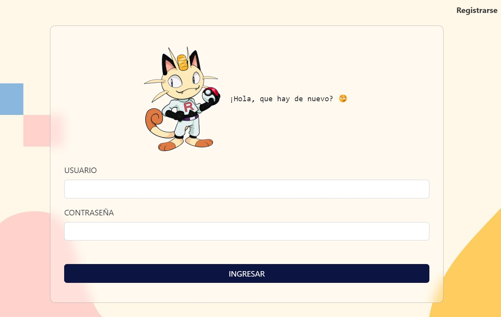

<h1 align="center">Pokemon Favorite</h1>

  

## Características de la pagina web de Pokemon Favorite:
### Ha sido estructurado con los lenguajes:
- HTML5
- Javascript

### También se está utilizando los siguientes Frameworks:
- Bootstrap 5
- Express

### Y para el backend estamos utilizando las siguientes tecnologias:
- MongooDB
- Node
------------------------------------------------------------------------------------------------------
### Git
- Clonar un repositorio: git clone URLdelRepositorio
- Crear nueva rama: git checkout -b nombreDeLaRama
- Moverse entre ramas: git switch nombreDeLaRama
- Ver listado de ramas: git branch -a
- Jalar ramas de la nube: git fetch
- Empujar mi rama a la nube: git push origin nombreDeLaRama
- Jalar los cambios de una rama: git pull origin nombreDeLaRama
- Stagear cambios: git add .
- Commitear cambios: git commit -m "nombre del commit"
-----------------------------------------------------------------------------------------------------
### Este trabajo está siendo realizado por el Team Bicho, los integrantes son los siguientes:
- Maestro Pokemon Danfer Lino
- Maestro Pokemon Oscar Velasquéz
- Maestro Pokemon Harry Ramos
- Maestra Pokemon Shirley Ayala
- Maestro Pokemon Michael Vargas
